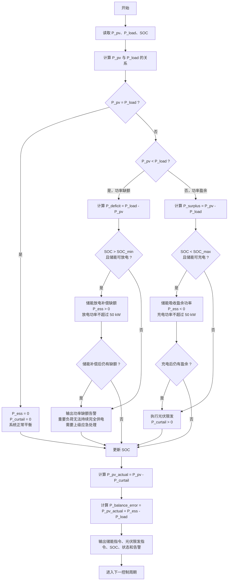

# 附加题流程图

```mermaid
flowchart TD
    A["开始"] --> B["读取 P_pv、P_load、SOC"]
    B --> C["计算 P_pv 与 P_load 的关系"]
    C --> D{"P_pv = P_load ?"}
    D -->|是| E["P_ess = 0<br/>P_curtail = 0<br/>系统正常平衡"]
    D -->|否| F{"P_pv < P_load ?"}

    F -->|是，功率缺额| G["计算 P_deficit = P_load - P_pv"]
    G --> H{"SOC > SOC_min<br/>且储能可放电 ?"}
    H -->|是| I["储能放电补偿缺额<br/>P_ess > 0<br/>放电功率不超过 50 kW"]
    H -->|否| J["输出功率缺额告警<br/>重要负荷无法持续完全供电<br/>需要上级应急处理"]
    I --> K{"储能补偿后仍有缺额 ?"}
    K -->|是| J
    K -->|否| L["更新 SOC"]

    F -->|否，功率盈余| M["计算 P_surplus = P_pv - P_load"]
    M --> N{"SOC < SOC_max<br/>且储能可充电 ?"}
    N -->|是| O["储能吸收盈余功率<br/>P_ess < 0<br/>充电功率不超过 50 kW"]
    N -->|否| P["执行光伏限发<br/>P_curtail > 0"]
    O --> Q{"充电后仍有盈余 ?"}
    Q -->|是| P
    Q -->|否| L
    P --> L
    J --> L
    E --> L

    L --> R["计算 P_pv_actual = P_pv - P_curtail"]
    R --> S["计算 P_balance_error = P_pv_actual + P_ess - P_load"]
    S --> T["输出储能指令、光伏限发指令、SOC、状态和告警"]
    T --> U["进入下一控制周期"]
```
